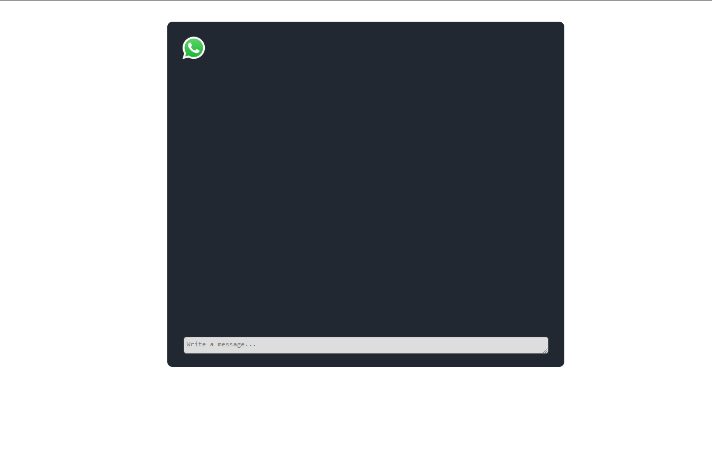

# Group Chat Application

- Visit **[Click Me](https://chatapp-roan-theta.vercel.app/)**
- Visit **[Click Me](https://lucy-chatapp.onrender.com/)** 

This project is a simple real-time group chat application that uses HTML, CSS, JavaScript (with Socket.IO), and Node.js. It provides a user interface for sending and receiving messages in a chat environment.



## Description

The Group Chat Application allows users to join a chatroom and exchange messages in real-time. The application features:

- **A chat interface**: Users can see their messages and messages from others.
- **User input area**: A text area for typing messages.
- **Real-time communication**: Messages are sent and received using Socket.IO.

### Key Components

#### 1. **HTML (`index.html`)**

Sets up the structure of the chat application. It includes:
- A section for displaying messages.
- An input area for typing new messages.
- Links to external CSS and JavaScript files.

#### 2. **CSS (`style.css`)**

Styles the chat application to provide a clean and user-friendly interface. It handles:
- Layout and spacing.
- Background colors and text colors.
- Appearance of messages and input areas.

#### 3. **JavaScript (`client.js`)**

Handles real-time messaging using Socket.IO. It:
- Prompts users to enter their name upon starting the application.
- Listens for 'Enter' key presses to send messages.
- Appends incoming and outgoing messages to the chat area.

#### 4. **Server-side JavaScript (`app.js`)**

Sets up an Express server and integrates Socket.IO for real-time communication. It:
- Serves static files from the `public` directory.
- Listens for new messages and broadcasts them to all connected clients.

## Usage

1. **Start the Server**

   Run the following command in the terminal to start the server:

   ```bash
   node app.js

## Access the Application

To access the chat application:

1. Open a web browser.
2. Navigate to `http://localhost:3000`.

## Interact with the Chat

- **Enter Your Name**: Upon loading the application, a prompt will ask you to enter your name.
- **Send Messages**: Type a message in the text area and press "Enter" to send it.
- **Receive Messages**: Messages from other users will appear in real-time in the chat area.

## File Structure

- `index.html`: Main HTML file for the chat interface.
- `style.css`: CSS file for styling the application.
- `client.js`: JavaScript file for handling client-side logic and real-time communication.
- `app.js`: Node.js server file for setting up the server and handling real-time messaging.
- `public/`: Directory containing static files (e.g., `style.css`, `client.js`, images).

## Dependencies

- **Node.js**: JavaScript runtime for running the server-side code.
- **Express**: Web framework for setting up the server.
- **Socket.IO**: Library for real-time communication between clients and server.

## Acknowledgments

- **Socket.IO**: For enabling real-time bidirectional event-based communication.
- **Express**: For providing a simple and flexible web server framework.

   

